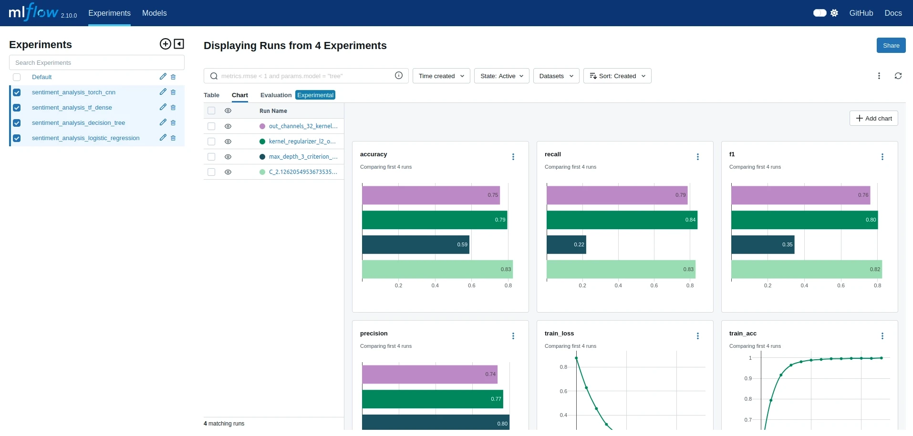

# NLP Analysis Sentiment

Sentiment Analysis using three different frameworks: [Scikit-Learn](https://scikit-learn.org/), [Keras](https://keras.io/), and [PyTorch](https://pytorch.org/). Also, I use [MLFlow](https://mlflow.org/) for tracking model performance for different experiments.

# Notebooks

All the code are in the Jupyter Notebooks:

1. Download the data &rarr; [00_Data.ipynb](./notebooks/00_Data.ipynb)
2. Scikit-Learning approach &rarr; [01_ScikitLearn.ipynb](./notebooks/01_ScikitLearn.ipynb)
3. TensorFlow / Keras approach &rarr; [02_TensorFlow.ipynb](./notebooks/02_TensorFlow.ipynb)
4. PyTorch approach &rarr; [03_PyTorch.ipynb](./notebooks/03_PyTorch.ipynb)

# Python Dependencies

Choose one option below, [1](#1-poetry) or [2](#2-virtualenv). 

**NOTE:** I put all packages into a one environment, and it is not the best thing to do because of the dependencies of TensorFlow and PyTorch.

## 1. Poetry

```console
# project root
$ poetry install  # you need to have poetry installed
```

## 2. Virtualenv

```console
$ python -m venv .venv
$ source .venv/bin/activate  # Unix
$ pip install -r requirements.txt
```

# MLFLow Tracking Server (Local)

For running a [MLFlow tracking server](https://mlflow.org/docs/latest/tracking.html) locally, execute:

```console
$ mlflow server --host 127.0.0.1 --port 8080
```

You can access the MLFlow server on [http://127.0.0.1:8080](http://127.0.0.1:8080)

# Final Results

After running the experiments present on the [notebooks](notebooks/):



---

<div align="center">

🚀 **Created by brenoAV**

</div>
